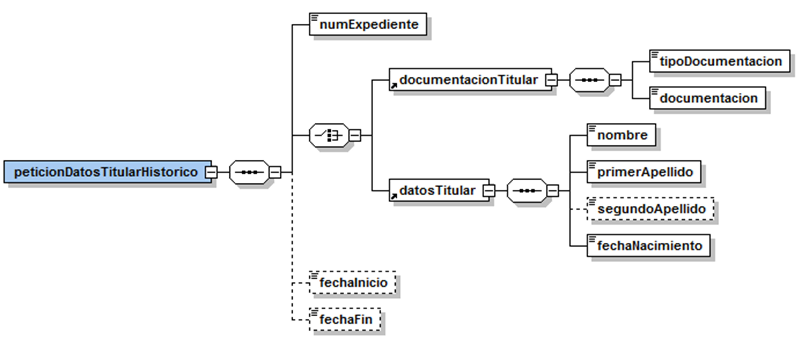
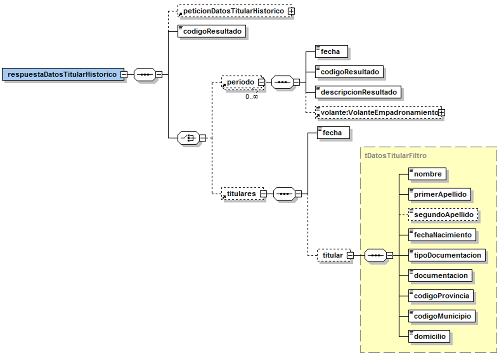
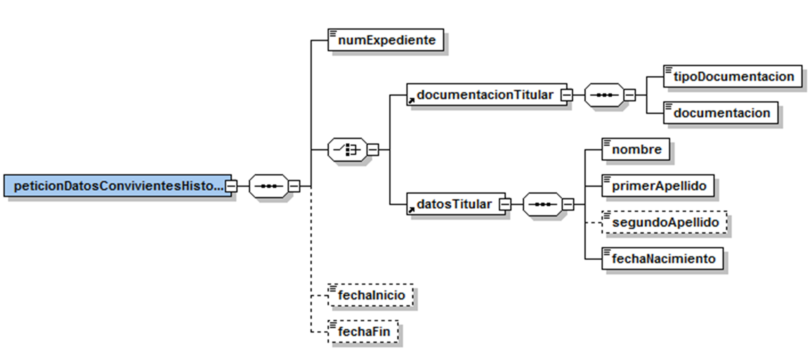
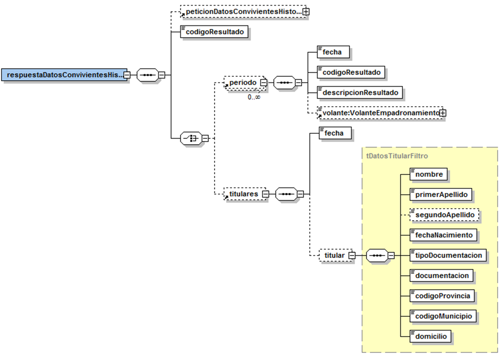

# Via Oberta – Informe històric d’empadronament
Document d’integració del servei.

Podreu trobar els XSD's del servei en aquest repositori sota el directori [/schema](https://github.com/ConsorciAOC/PADRO_HISTORIC/tree/main/schema).

## Control del document

### Informació general

|**Títol:**|Via Oberta – Informe històric d’empadronament. Document d’integració del servei|
| - | - |
|**Creat per:**|Departament de Desenvolupament|
|**A revisar per:**|Departament de Desenvolupament|
|**A aprovar per:**|Departament de Desenvolupament|
|**Llista de distribució:**||
|**Nom del document:**| DI - Via Oberta - PADRO HISTORIC.doc|

### Històric de revisions

|**Versió**|**Data**|**Autor**|**Comentaris**|
| :-: | :-: | :-: | :-: |
|V1.0|10/10/2011|Roger Noguera i Arnau|Creació del document|

## Índex

- [1. Introducció](#1)
- [2. Transmissions de dades disponibles](#2)
   * [2.1 Dades disponibles](#2.1)

- [3. Missatgeria dels serveis](#3)
   * [3.1 Dades històriques de residència (TITULAR\_HISTORIC)](#3.1)
      * [3.1.1 Petició – dades específiques](#3.1.1)
        * [3.1.1.1 Criteris de cerca](#3.1.1.1)
        * [3.1.1.2 Interval temporal de cerca](#3.1.1.2)
      * [3.1.2 Resposta – dades específiques](#3.1.2)
   * [3.2 Dades històriques de convivència (CONVIVENTS\_HISTORIC)](#3.2)
      * [3.2.1 Petició – dades específiques](#3.2.1)
      * [3.2.2 Resposta – dades específiques](#3.2.2)
- [4. Joc de proves](#4)

## 1 Introducció 

Aquest document detalla la missatgeria associada al servei corresponent a l'informe històric d'empadronament.

Per a poder realitzar la integració cal conèixer prèviament la següent documentació:

- Document de Missatgeria Genèrica de la PCI del Consorci AOC.

## 2 Transmissions de dades disponibles 
Les dades disponibles a través del servei són les que es presenten a continuació:
- **EMISSOR**: CAOC (Consorci Administració Oberta de Catalunya)

| **PRODUCTE** | **MODALITAT** | **DESCRIPCIO** |
| --- | --- | --- |
| **PADRO\_HISTORIC** | [TITULAR\_HISTORIC](#3.1) | Dades històriques de residència (IDESCAT).|
| **PADRO\_HISTORIC** | [CONVIVENTS\_HISTORIC](#3.2) | Dades històriques de convivència (IDESCAT). |

Totes les consultes del producte tenen disponible la versió imprimible del resultat de la consulta en format PDF. Per més detalls adreceu-vos a l'apartat _Extensions de missatgeria_ del document de missatgeria genèrica.

> :warning: Les modalitats de consum de l'informe històric d'empadronament NO s'accepten lots de sol·licituds.

### 2.1 Dades disponibles 
Les dades disponibles via aquest servei són les corresponents a les extraccions del Registre de Població de Catalunya d'Idescat en data:

- 01/07/2006
- 01/07/2008
- 01/07/2010
- 01/01/2007
- 01/01/2009
- 01/01/2011
- 01/07/2007
- 01/07/2009
- 01/07/2011
- 01/01/2008
- 01/01/2010

## 3 Missatgeria dels serveis 
A continuació es detalla la missatgeria corresponent al bloc de dades específiques de les modalitats de consum del producte.

### 3.1 Dades històriques de residència (TITULAR\_HISTORIC) 

#### 3.1.1 Petició – dades específiques 

| _Element_ | _Descripció_ |
| --- | --- |
| peticionDatosTitularHistorico/numExpediente | Número d'expedient.|
| peticionDatosTitularHistorico/documentacionTitular | Criteri de cerca: documentació del titular.|
| peticionDatosTitularHistorico/documentacionTitular/tipoDocumentacion | 1: NIF, 2: passaport, 3: permís residència / NIE|
| peticionDatosTitularHistorico/documentacionTitular/documentacion| Documentació.|
| peticionDatosTitularHistorico/datosTitular | Criteri de cerca: dades del titular. |
| peticionDatosTitularHistorico/datosTitular/nombre | Nom del titular (en majúscules i sense accents). |
| peticionDatosTitularHistorico/datosTitular/primerApellido | Primer cognom del titular (en majúscules i sense accents). |
| peticionDatosTitularHistorico/datosTitular/segundoApellido | Segon cognom del titular (en majúscules i sense accents). |
| peticionDatosTitularHistorico/datosTitular/fechaNacimiento | Data de naixement del titular (AAAAMMDD). |
| peticionDatosTitularHistorico/fechaInicio | Data llindar de cerca inferior en cas de voler acotar la cerca.|
| peticionDatosTitularHistorico/fechaFin | Data llindar de cerca superior en cas de voler acotar la cerca.|

##### 3.1.1.1 Criteris de cerca 
- Per documentació del titular.
- Per dades del titular: permet localitzar el titular per nom, cognoms i data de naixement.

Si les dades informades resolen un únic titular en la darrera base de dades d'IDESCAT el servei retornarà l'informe històric del titular.

En cas de més ocurrències, el servei retornarà una llista dels titulars que s'ajusten a les dades informades en la petició (limitada a un màxim de 20) i que permetrà refinar la consulta per documentació.

##### 3.1.1.2 Interval temporal de cerca 
- Cada base de dades d'IDESCAT té associada una data de vigència corresponent a la data d'extracció de les dades.

- fechaInicio / fechaFin permeten acotar el període temporal sobre el qual es realitza la consulta. El sistema retorna el resultat de consultar el titular en les bases de dades d'IDESCAT la data de vigència de les quals estan compreses en l'interval de dates informat a la petició.

- Si no s'informa interval, la consulta es realitza sobre totes les bases de dades d'IDESCAT disponibles.

- Si només s'informa fechaInicio es consulten les bases de dades d'IDESCAT la data de vigència de les quals estan compreses entre la data d'inici informada en la petició i la darrera base de dades disponible (la més recent).

- Si només s'informa fechaFin es consulten totes les bases de dades d'IDESCAT les dates de vigència de les quals estan compreses entre la base de dades més antiga disponible i la data de fi informada en la petició.

#### 3.1.2 Resposta – dades específiques 
| _Element_ | _Descripció_ |
| --- | --- |
| respuestaDatosTitularHistorico/peticionDatosTitularHistorico | Bloc de dades corresponent a la petició que origina la resposta.|
| respuestaDatosTitularHistorico/codigoResultado | 0: Operació realitzada correctament, 1: Error realitzant la consulta |
| respuestaDatosTitularHistorico/periodo | Dades del titular per cada període de dades disponible (extracció de dades IDESCAT). |
| //periodo/fecha | Data de vigència de les dades (de la base de dades d'IDESCAT de la qual s'han consultat les dades). AAAAMMDD.|
| //periodo/codigoResultado|<ul><li>1: El titular CONSTA en la fecha indicada amb les dades que consten a VolanteEmpadronamiento.</li><li>2: El titular NO CONSTA en el Registre de la Població de Catalunya en la fecha indicada.</li></ul>|
| //periodo/descripcionResultado| Descripció del resultat. |
| //periodo/VolanteEmpadronamiento | Si CONSTA, bloc de dades corresponent al volant de padró. |
| //titulares | Bloc de dades amb les dades dels titulars que s'ajusten a les dades informades en la petició. Les dades que es s'informen són tal i com es reflecteixen a la base de dades d'IDESCAT.|
| //titulares/fecha | Data de vigència de les dades (de la base de dades d'IDESCAT de la qual s'han consultat les dades). AAAAMMDD.|
| //titulares/titular/nombre | Nom del titular.|
| //titulares/titular/primerApellido | Primer cognom del titular.|
| //titulares/titular/segundoApellido | Segon cognom del titular.|
| //titulares/titular/fechaNacimiento | Data naixement.|
| //titulares/titular/tipoDocumentacion | 1: NIF, 2: passaport, 3: permís residència / NIE|
| //titulares/titular/documentacion | Documentació.|
| //titulares/titular/codigoProvincia | Codi de província.|
| //titulares/titular/codigoMunicipio | Codi de municipi. |
| //titulares/titular/domicilio | Domicili. |

## 3.2 Dades històriques de convivència (CONVIVENTS\_HISTORIC) 
Les consideracions respecte als criteris i interval de temporal de cerca de la modalitat de consum TITULAR\_HISTORIC apliquen a aquesta modalitat.

### 3.2.1 Petició – dades específiques 

| _Element_ | _Descripció_ |
| --- | --- |
| peticionDatosConvivientesHistorico/numExpediente | Número d'expedient.|
| peticionDatosConvivientesHistorico/documentacionTitular | Criteri de cerca: documentació del titular.|
| peticionDatosConvivientesHistorico/documentacionTitular/tipoDocumentacion | 1: NIF, 2: passaport, 3: permís residència / NIE |
| peticionDatosConvivientesHistorico/documentacionTitular/documentacion| Documentació.|
| peticionDatosConvivientesHistorico/datosTitular | Criteri de cerca: dades del titular. |
| peticionDatosConvivientesHistorico/datosTitular/nombre| Nom del titular (en majúscules i sense accents). |
| peticionDatosConvivientesHistorico/datosTitular/primerApellido| Primer cognom del titular (en majúscules i sense accents). |
| peticionDatosConvivientesHistorico/datosTitular/segundoApellido| Segon cognom del titular (en majúscules i sense accents). |
| peticionDatosConvivientesHistorico/datosTitular/fechaNacimiento| Data de naixement del titular (AAAAMMDD). |
| peticionDatosConvivientesHistorico/fechaInicio | Data llindar de cerca inferior en cas de voler acotar la cerca. |
| peticionDatosConvivientesHistorico/fechaFin | Data llindar de cerca superior en cas de voler acotar la cerca.|

### 3.2.2 Resposta – dades específiques 

| _Element_ | _Descripció_ |
| --- | --- |
| respuestaDatosConvivientesHistorico/peticionDatosConvivientesHistorico | Bloc de dades corresponent a la petició que origina la resposta. |
| respuestaDatosConvivientesHistorico/codigoResultado | 0: Operació realitzada correctament, 1: Error realitzant la consulta |
| respuestaDatosConvivientesHistorico/periodo | Dades del titular per cada període de dades disponible (extracció de dades IDESCAT). |
| //periodo/fecha | Data de vigència de les dades (de la base de dades d'IDESCAT de la qual s'han consultat les dades). |
| //periodo/codigoResultado | <ul><li>El titular CONSTA en la fecha indicada amb les dades que consten a VolanteEmpadronamiento.</li><li>El titular NO CONSTA en el Registre de la Població de Catalunya en la fecha indicada.</li></ul> |
| //periodo/descripcionResultado | Descripció del resultat. |
| //periodo/VolanteEmpadronamiento | Si CONSTA, bloc de dades corresponent al volant de convivència. |
| //titulares | Bloc de dades amb les dades dels titulars que s'ajusten a les dades informades en la petició. Les dades que es s'informen són tal i com es reflecteixen a la base de dades d'IDESCAT. |
| //titulares/fecha | Data de vigència de les dades (de la base de dades d'IDESCAT de la qual s'han consultat les dades). AAAAMMDD. |
| //titulares/titular/nombre | Nom del titular. |
| //titulares/titular/primerApellido | Primer cognom del titular. |
| //titulares/titular/segundoApellido | Segon cognom del titular. |
| //titulares/titular/fechaNacimiento | Data naixement. |
| //titulares/titular/tipoDocumentacion | 1: NIF, 2: passaport, 3: permís residència / NIE |
| //titulares/titular/documentacion | Documentació. |
| //titulares/titular/codigoProvincia | Codi de província. |
| //titulares/titular/codigoMunicipio | Codi de municipi. |
| //titulares/titular/domicilio | Domicili. |

## 4 Joc de proves 

> :warning: Cal tenir present que la informació que es consulta és confidencial i l'usuari és responsable de la seva utilització únicament en el marc de l'activitat laboral i en la estricta forma que exigeixi el compliment de les seves funcions. El CAOC emmagatzema, per a les corresponents auditories, les dades de les persones que hi accedeixen i les consultes efectuades.

La base de dades amb el Registre de la Població de Catalunya de l'entorn de pre-producció conté el següent titular de prova enregistrat en els següents períodes:

| _Període_ | _Titulars_ |
| --- | --- |
| 01/2011 |<ul><li>Titular: 10101010P</li><li>Acompanyant: 20202020Q</li><li>Acompanyant: 30303030R</li></ul>|
| 01/2010 |<ul><li>Titular: 10101010P</li></ul>|
| 07/2009 |<ul><li>Titular: 10101010P</li><li>Acompanyant: 20202020Q</li><li>Acompanyant: 30303030R</li></ul>|
| 01/2009 |<ul><li>Titular: 10101010P</li><li>Acompanyant: 20202020Q</li></ul>|
| 01/2007 |<ul><li>Titular: 10101010P</li></ul>|

